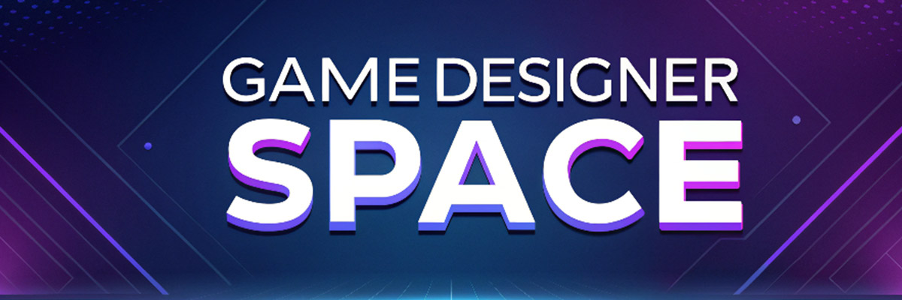

# 🎮 Game Designer Space - Blog e Dev Log sobre Desenvolvimento de Jogos

  

Bem-vindo ao repositório do meu blog e dev log pessoal, um espaço onde compartilho minha jornada como desenvolvedor de jogos e principalmente game designer! Este projeto não é apenas um site; é um diário de desenvolvimento (dev log) repleto de aprendizados, desafios e conquistas no incrível universo de criação de jogos.  

---

## 📝 Sobre o Blog

Este blog/devlog é minha forma de documentar o processo criativo e técnico por trás do desenvolvimento de jogos. Aqui, você encontrará:  

- **Insights Pessoais**: Reflexões sobre minha evolução como desenvolvedor e designer.  
- **Diário de Desenvolvimento**: Relatos dos bastidores, incluindo erros, acertos e aprendizados.  
- **Inspirações e Desafios**: Compartilho experiências que moldam minha visão no mundo dos games.  

Tudo com uma abordagem descontraída e autêntica!

---

## 🚀 Tecnologias Utilizadas

Este projeto foi desenvolvido utilizando as seguintes tecnologias:  

- **HTML5, CSS3 e JavaScript**: A base da construção do site.  
- **Astro**: Framework estático para gerar um site rápido, leve e eficiente.  
- **Markdown**: Para gerenciar as postagens do blog.  

Este é o meu primeiro contato com Astro e com a criação de conteúdo estático com MD, portanto propositalmente o meu aprendizado já se iniciou no momento em que comecei a desenvolver este site! 

---

## 🎯 Objetivos do Projeto

1. **Inspirar outros desenvolvedores**: Mostrar que os desafios fazem parte da jornada.  
2. **Compartilhar conhecimento**: Criar um espaço para troca de ideias e aprendizado contínuo.  
3. **Documentar minha evolução**: Acompanhar meu crescimento profissional ao longo do tempo.  

---

## 🖼️ Estrutura do Repositório

- `/src` - Arquivos de código-fonte do site e blog.  
- `/public` - Imagens, ícones e recursos estáticos.  
- `/posts` - Arquivos Markdown com o conteúdo das postagens do blog.  

---

## 🌟 Como Contribuir

Embora este seja um projeto pessoal, feedbacks e sugestões são sempre bem-vindos! Se tiver algo a compartilhar, sinta-se à vontade para abrir uma **issue** ou criar um **pull request**.  

ou...

**Me compre um** [Ginger Ale!](https://buymeacoffee.com/skedar) 🧋

---

## 📬 Contato

Quer trocar uma ideia ou colaborar? Me encontre em:  
- **Email**: contato@skedarcorp.com  
- **LinkedIn**: [SeuPerfilLinkedIn](https://www.linkedin.com/in/skedarcorp/)  
- **Portfólio**: [SeuPortfolio](https://skedar.github.io/)  
- **Site Pessoal**: [SeuPortfolio](https://skedarcorp.com/)  

---

**"Desenvolver jogos é uma jornada incrível. Espero que este projeto inspire você tanto quanto me inspira a continuar aprendendo e criando!"**  

---
